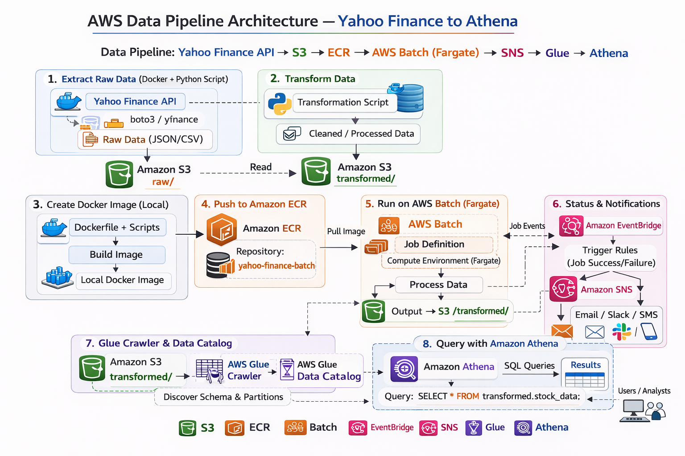

# Financial Data Engineering Pipeline

## Project Description
This project implements a scalable **end-to-end data pipeline** that automates the extraction of financial market data using the **Yahoo Finance API**. The architecture follows a modern data lake pattern where raw data is ingested into **AWS S3**, processed, and stored in a transformed layer. Infrastructure is managed as code using **Terraform**, while **Docker** ensures a consistent environment for the data ingestion logic.

---

## 1. Prerequisites
Before setting up the project, ensure you have the following installed and configured:

*   **AWS Account**: An active [AWS Free Tier](https://aws.amazon.com) or professional account.
*   **AWS CLI**: Installed and configured with your local machine. Refer to the [AWS CLI Setup Guide](https://docs.aws.amazon.com).
*   **Terraform**: Version 1.0 or higher. [Download Terraform](https://www.terraform.io).
*   **Docker**: Ensure Docker is installed and running. [Docker Desktop](https://www.docker.com).
*   **Yahoo API**: Ensure you signup and retrieve Yahoo API key from [Yahoo API](https://financeapi.net/).

---

## 2. Initialisation

> [!IMPORTANT]
> **Manual AWS Setup Tasks**
> The following steps must be completed in the [AWS Management Console](https://console.aws.amazon.com) before running the automation scripts.

### IAM Configuration
1.  **Create IAM User**: From your **Root Account**, create a new IAM user.
2.  **Permissions**: Attach the `AdministratorAccess` policy to this user.
3.  **Security Credentials**: Generate an **Access Key** and **Secret Access Key**. Save these locally for CLI configuration.

### Secrets Management
Navigate to [AWS Secrets Manager](https://aws.amazon.com) and create a secret containing the following keys:
*   `Yahoo_API`

### Storage Layer
Create an **S3 Bucket** (e.g., `my-data-engineering-project`) and manually create the following folder structure:
*   `raw/`
*   `transformed/`
  
> [!IMPORTANT]
> **Enter the bucket name inside tfvars Terraform file or change Bucket name inside raw_script and transforned scripts(Python)**
> After creating S3 bucket Name, Copy this Bucket name and paste it inside raw and transformed script files on Bucket names initialised
---

## 3. Deployment & Execution

### Pull the Repository
Clone the project to your local environment:
```bash
cd data-engineering-project
git clone https://github.com/noel-saji/aws-data-engineering-yahoo-finance.git
```

## 🛠 4. Infrastructure as Code (IaC)

This project leverages **Terraform** to provision and manage cloud resources consistently. All configuration files are housed within the `/terraform` directory.

### 📁 Directory Structure

```text
terraform/
├── main.tf            # S3, IAM, and Security definitions
├── variables.tf       # Input variables
├── providers.tf       # AWS provider configuration
└── outputs.tf         # Key resource IDs (Bucket names, etc.)
```


---

## 🚀 Deployment Workflow

### 1️⃣ Initialize

Download the required AWS provider and initialize Terraform:

```bash
terraform init
```
### 2️⃣ Plan

Preview the changes Terraform will apply to your infrastructure:

```bash
terraform plan
```

### 3️⃣ Apply

Deploy the resources to AWS:

```bash
terraform apply
```

## 🧹 5. Cleanup

To delete all provisioned AWS resources and prevent unnecessary costs:

```bash
terraform destroy
```

## 🏗️ Architecture

This project implements an automated, event-driven financial data pipeline on AWS.  
The workflow follows a fully managed and scalable architecture:

**Docker(Python files=Raw and Transformed) → Amazon ECR → AWS Batch → Amazon EventBridge → AWS Glue Crawler → Amazon Athena**


<p align="center">
  
</p>

---

### 🔹 1. Docker (Containerized Application)

The financial data ingestion and processing logic is packaged into a Docker container.

- Encapsulates dependencies and runtime environment
- Ensures consistent execution across environments
- Produces processed output files for storage in Amazon S3

---

### 🔹 2. Amazon ECR (Elastic Container Registry)

The Docker image is pushed to **Amazon ECR**, which acts as a secure container registry.

- Stores versioned container images
- Enables seamless integration with AWS Batch
- Provides secure image access via IAM roles

---

### 🔹 3. AWS Batch (Compute Orchestration)

AWS Batch runs the containerized workload at scale.

- Pulls the Docker image from ECR
- Executes ingestion and transformation jobs
- Writes processed datasets to Amazon S3
- Automatically provisions compute resources as needed

---

### 🔹 4. Amazon EventBridge (Event Triggering)

Amazon EventBridge enables event-driven orchestration.

- Triggers AWS Batch jobs on a schedule or rule
- Automates pipeline execution without manual intervention
- Enables time-based or event-based processing

---

### 🔹 5. AWS Glue Crawler (Metadata Discovery)

After data is written to Amazon S3, a Glue Crawler:

- Scans the processed data
- Infers schema automatically
- Updates the AWS Glue Data Catalog
- Makes datasets query-ready

---

### 🔹 6. Amazon Athena (Serverless Query Layer)

Amazon Athena enables analytics directly on S3 data.

- Queries data using SQL
- Reads schema from Glue Data Catalog
- Enables ad-hoc analysis and reporting
- No infrastructure management required

---

## 🔁 End-to-End Flow

