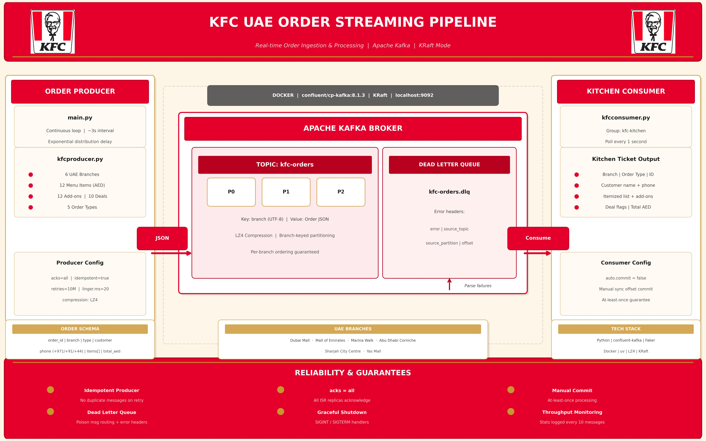

# KFC Order Streaming — Kafka Pipeline

> **Note:** This is **just a demo Kafka pipeline** for consuming messages
> from **fake data being produced** — no real KFC systems, customers, or
> orders are involved. The producer fabricates synthetic UAE order traffic
> with `faker` purely to exercise the broker/consumer flow.

A small Kafka project that simulates KFC UAE order traffic and streams it
through a single-node Kafka broker into a "kitchen" consumer, with a
dead-letter queue for poison messages.

## Architecture



## Running locally

This project is managed with [`uv`](https://docs.astral.sh/uv/).

### 1. Start Kafka

```bash
docker compose up -d
```

Launches `confluentinc/cp-kafka:8.1.3` in KRaft mode on `localhost:9092`,
with broker data persisted to the `kafka_kraft` volume.

### 2. Sync dependencies

From the project root:

```bash
uv sync
```

Required packages: `confluent-kafka`, `faker`. Add them with
`uv add confluent-kafka faker` if they are not already in `pyproject.toml`.

### 3. Start the consumer

```bash
uv run python kafka/kfcconsumer.py
```

You should see:
```
🟢 KFC kitchen consumer running on 'kfc-orders' (group=kfc-kitchen).
```

### 4. Start the producer

In a separate terminal:

```bash
uv run python kafka/main.py
```

Orders stream with a random exponential delay (mean 3 s) between messages.
The consumer prints each one as a formatted kitchen ticket.

### 5. Stop

`Ctrl+C` in either terminal — both shut down gracefully and flush pending
work.

## Topics

| Topic | Purpose | Key | Value |
|-------|---------|-----|-------|
| `kfc-orders` | Live order stream | branch name (UTF-8) | order JSON |
| `kfc-orders.dlq` | Poison messages from `kfc-orders` | original key | original bytes + error headers |

## Sample output

### Producer (`main.py`)

```text
2026-05-18 14:32:10,021 INFO kfc-producer 🟢 KFC order producer started on topic 'kfc-orders'. SIGINT/SIGTERM to stop.
2026-05-18 14:32:10,118 INFO kfc-producer 📤 KFC Dubai Mall | Deliveroo | Aisha Al-Marri | +971 0529384716 | 2 item(s) | total: AED 54
2026-05-18 14:32:10,143 INFO kfc-producer ✅ Delivered to kfc-orders [partition 0 | offset 0]
2026-05-18 14:32:12,407 INFO kfc-producer 📤 KFC Yas Mall | Uber Eats | Rahul Menon | +971 0501122334 | 1 item(s) | total: AED 31
2026-05-18 14:32:12,431 INFO kfc-producer ✅ Delivered to kfc-orders [partition 0 | offset 1]
2026-05-18 14:32:15,882 INFO kfc-producer 📤 KFC Marina Walk | Dine In | Sara Hassan | +971 0567281930 | 3 item(s) | total: AED 88
2026-05-18 14:32:15,905 INFO kfc-producer ✅ Delivered to kfc-orders [partition 0 | offset 2]
...
2026-05-18 14:32:41,612 INFO kfc-producer 📈 Throughput: 10 orders sent, 0.32 orders/sec
^C
2026-05-18 14:32:45,008 INFO kfc-producer 🔴 Received signal 2, stopping producer...
2026-05-18 14:32:45,009 INFO kfc-producer Flushing pending messages...
2026-05-18 14:32:45,124 INFO kfc-producer 🏁 Producer shut down cleanly. Total sent: 12
```

### Consumer (`kfcconsumer.py`)

```text
2026-05-18 14:32:09,884 INFO kfc-consumer 🟢 KFC kitchen consumer running on 'kfc-orders' (group=kfc-kitchen). SIGINT/SIGTERM to stop.
2026-05-18 14:32:10,196 INFO kfc-consumer ==========================================================================================
2026-05-18 14:32:10,196 INFO kfc-consumer 🍗 New KFC order from 🏬 KFC Dubai Mall
2026-05-18 14:32:10,196 INFO kfc-consumer    Type     : Deliveroo
2026-05-18 14:32:10,196 INFO kfc-consumer    Order ID : 8f3c1a52-7b9e-4d10-9f44-c2a1b6e8d011
2026-05-18 14:32:10,196 INFO kfc-consumer    Customer : Aisha Al-Marri
2026-05-18 14:32:10,196 INFO kfc-consumer    Phone    : +971 0529384716
2026-05-18 14:32:10,196 INFO kfc-consumer    Items    : 2
2026-05-18 14:32:10,196 INFO kfc-consumer      1. 🍔 Zinger Burger (AED 19)  →  🍟 Large Fries (AED 13), 🥤 Pepsi (AED 7)
2026-05-18 14:32:10,196 INFO kfc-consumer      2. 🔥 8 Pcs Hot & Crispy Bucket (AED 79) 🎁 DEAL  →  no add-ons
2026-05-18 14:32:10,196 INFO kfc-consumer    💰 TOTAL : AED 54
2026-05-18 14:32:10,196 INFO kfc-consumer    [partition 0 | offset 0 | key KFC Dubai Mall]
...
2026-05-18 14:32:35,407 INFO kfc-consumer 📈 Throughput: 10 processed (0 to DLQ), 0.31 msg/sec
^C
2026-05-18 14:32:50,221 INFO kfc-consumer 🔴 Received signal 2, stopping consumer...
2026-05-18 14:32:50,222 INFO kfc-consumer Flushing DLQ producer and closing consumer...
2026-05-18 14:32:50,335 INFO kfc-consumer 🏁 Consumer closed cleanly. Processed=12, DLQ=0
```

### Consumer — poison message routed to DLQ

```text
2026-05-18 14:33:02,114 ERROR kfc-consumer ❌ Poison message at offset 47, value=b'{"order_id": "bad"', forwarding to DLQ: Expecting value: line 1 column 1 (char 0)
Traceback (most recent call last):
  File "kfcconsumer.py", line 132, in <module>
    handle_order(msg)
  ...
json.decoder.JSONDecodeError: Expecting property name enclosed in double quotes
2026-05-18 14:33:02,127 INFO  kfc-consumer 📈 Throughput: 50 processed (1 to DLQ), 0.34 msg/sec
```

## Sample order payload

```json
{
  "order_id": "a1b2c3d4-...",
  "branch": "KFC Dubai Mall",
  "type": "Deliveroo",
  "customer_name": "Jane Doe",
  "phone_number": "+971 0123456789",
  "items": [
    {
      "name": "🍔 Zinger Burger",
      "price_aed": 19,
      "addons": [{"name": "🍟 Large Fries", "price_aed": 13}],
      "is_deal": false
    }
  ],
  "total_aed": 32
}
```

## Notes

- Menu prices in `kfcproducer.py` are realistic AED defaults — `uae.kfc.me`
  is a JS-rendered SPA and could not be scraped live. Adjust as needed.
- The cluster is single-node with replication factor 1; this is a learning
  setup, not a production topology.
