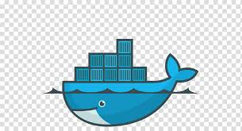

# 🚀 Enterprise Data Pipeline: Yahoo Finance to Athena
> **Architecture:** Automated ETL Pipeline using Containerized Python, AWS Batch, and Glue Data Cataloging.

 &nbsp; 
 &nbsp; 
 &nbsp; 


---

## 🏗️ Technical Architecture Breakdown

<p align="center">
  
</p>

### 1️⃣ Development & Containerization
The workflow begins by developing the extraction and transformation logic in Python.
*   **Scripts:** 
    *   `extract.py`: Pulls raw JSON data from Yahoo Finance.
    *   `transform.py`: Cleans and converts data into json format.
*   **Deployment:** These scripts are bundled into a **Docker Image**.
*   **Registry:** The image is pushed to **Amazon ECR**  to be used as the source for cloud execution.


### 2️⃣ Managed Compute with AWS Batch
Once the image is in **Amazon ECR**, AWS Batch handles the heavy lifting of the data processing tasks.
*   **Execution:** AWS Batch pulls the container image directly from the ECR repository.
*   **Environment:** It utilizes **AWS Fargate** for a serverless experience, automatically provisioning the CPU and Memory required for each run without the need to manage underlying servers.

---

### 3️⃣ Hourly Automation (EventBridge)
The pipeline is fully hands-off and automated through time-based triggers.
*   **Trigger:** An **Amazon EventBridge** scheduler is configured using a standard Cron expression.
*   **Frequency:** Set to run **every hour**, ensuring the data lake is updated with the latest market trends 24 times a day.

---

### 4️⃣ Observability & SNS Alerts
To ensure high uptime, the pipeline includes an automated alerting mechanism for real-time monitoring.
*   **Monitoring:** EventBridge listens for `Batch Job State Change` events directly from AWS Batch.
*   **Failure Protocol:** If a job fails, the event is immediately routed to an **Amazon SNS Topic**.
*   **Notification:** You receive an instant **Email Notification** containing error details, allowing for immediate debugging and intervention.

> [!IMPORTANT]
> **Email Subscription:** `your-email@domain.com` is subscribed to the `Pipeline-Alerts` SNS Topic.

---

### 5️⃣ Metadata & Data Catalog (AWS Glue)
To make the files stored in S3 "queryable" like a standard database, we leverage **AWS Glue**.
*   **Data Catalog:** Acts as the central metadata store for all data assets in the pipeline.
*   **Crawler:** A **Glue Crawler** automatically scans the `transformed/` S3 bucket to discover the schema (columns, data types) and update the table definitions.

---

### 6️⃣ High-Speed Analytics (Amazon Athena)
The final layer allows users and analysts to interact with the data using standard SQL without moving the data.
*   **Querying:** **Amazon Athena** queries the Glue Data Catalog to retrieve data from S3.
*   **Partitioning:** Since data is pushed in a **Partitioned Format** (e.g., `year=2024/month=03/`), Athena scans only the relevant data subsets.
*   **Result:** This significantly reduces query costs and increases processing speed.

```sql
-- Optimized Partitioned Query Example
SELECT 
    symbol, 
    AVG(price) AS average_price
FROM "finance_db"."stock_data"
WHERE year = '2024' 
  AND symbol = 'AAPL'
GROUP BY symbol;
