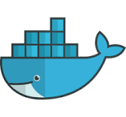

# Data Engineering for Financial Stock Market Pipeline 🛠️📊 

 &nbsp; 
 &nbsp; 
 &nbsp; 


### Project Overview: Serverless ELT Pipeline for Yahoo Finance

This project implements a **serverless, event-driven ELT pipeline** designed for the automated, hourly ingestion and transformation of **Yahoo Finance** stock data. The system captures raw market metrics—including OHLC prices and trading volumes—and processes them through a transformation layer that converts raw values into currency-normalized prices, adjusted closing rates, and hourly percentage changes.

### Technical Implementation

*   ✅ **Data Logic & Containerization**: Core ingestion and transformation are handled by **Python** scripts. These are packaged into **Docker** images and stored in **Amazon ECR** to ensure environment consistency.
*   ✅ **Orchestration & Compute**: **AWS Batch** manages the lifecycle of the containerized jobs, dynamically provisioning compute resources only when needed. These jobs are triggered hourly using **Amazon EventBridge**.
*   ✅ **Infrastructure as Code (IaC)**: The entire cloud environment—including networking, compute, and security—is provisioned and managed using **Terraform**, providing a repeatable and version-controlled deployment.
*   ✅ **Monitoring & Alerting**: Reliability is maintained through **Amazon SNS**, which sends automated email notifications to administrators in the event of a pipeline or job failure.
*   ✅ **Data Lake & Analytics**: Transformed data is registered in the **AWS Glue Data Catalog**. Users can perform high-performance SQL analysis on historical market trends via **Amazon Athena**, leveraging optimized **S3 data partitioning**.


---

## 1. Prerequisites
Before setting up the project, ensure you have the following installed and configured:

*   **AWS Account**: An active [AWS Free Tier](https://aws.amazon.com) or professional account.
*   **AWS CLI**: Installed and configured with your local machine. Refer to the [AWS CLI Setup Guide](https://docs.aws.amazon.com).
*   **Terraform**: Version 1.0 or higher. [Download Terraform](https://www.terraform.io).
*   **Docker**: Ensure Docker is installed and running. [Docker Desktop](https://www.docker.com).
*   **Yahoo API**: Ensure you signup and retrieve Yahoo API key from [Yahoo API](https://financeapi.net/).

---

## 2. Initialisation

> [!IMPORTANT]
> **Manual AWS Setup Tasks**
> The following steps must be completed in the [AWS Management Console](https://console.aws.amazon.com) before running the automation scripts.

### IAM Configuration
1.  **Create IAM User**: From your **Root Account**, create a new IAM user.
2.  **Permissions**: Attach the `AdministratorAccess` policy to this user.
3.  **Security Credentials**: Generate an **Access Key** and **Secret Access Key**. Save these locally for CLI configuration.

### Secrets Management
Navigate to [AWS Secrets Manager](https://aws.amazon.com) and create a secret containing the following keys:
*   `Yahoo_API`

### Storage Layer
Create an **S3 Bucket** (e.g., `my-data-engineering-project`) and manually create the following folder structure:
*   `raw/`
*   `transformed/`
  
> [!IMPORTANT]
> **Enter the bucket name inside tfvars Terraform file or change Bucket name inside raw_script and transforned scripts(Python)**
> After creating S3 bucket Name, Copy this Bucket name and paste it inside raw and transformed script files on Bucket names initialised
---

## 3. Deployment & Execution

### Pull the Repository
Clone the project to your local environment:
```bash
cd data-engineering-project
git clone https://github.com/noel-saji/aws-data-engineering-yahoo-finance.git
```

## 🛠 4. Infrastructure as Code (IaC)

This project leverages **Terraform** to provision and manage cloud resources consistently. All configuration files are housed within the `/terraform` directory.

### 📁 Directory Structure

```text
terraform/
├── main.tf            # S3, IAM, and Security definitions
├── variables.tf       # Input variables
├── providers.tf       # AWS provider configuration
└── outputs.tf         # Key resource IDs (Bucket names, etc.)
```


---

## 🚀 Deployment Workflow

### 1️⃣ Initialize

Download the required AWS provider and initialize Terraform:

```bash
terraform init
```
### 2️⃣ Plan

Preview the changes Terraform will apply to your infrastructure:

```bash
terraform plan
```

### 3️⃣ Apply

Deploy the resources to AWS:

```bash
terraform apply
```

## 🧹 5. Cleanup

To delete all provisioned AWS resources and prevent unnecessary costs:

```bash
terraform destroy
```


